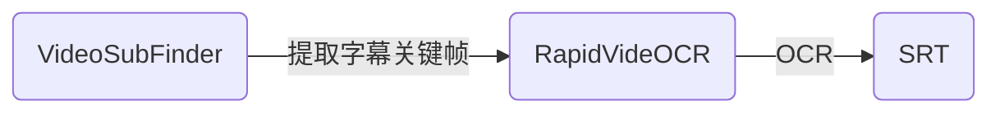

   

 

简体中文 | [English](https://github.com/SWHL/RapidVideOCR/blob/main/docs/README_en.md)

    
    <a href="">=3.7,<=3.10-aff.svg"></a>
    
    
    
    
    
    

    
目录

- [简介](#简介)
- [TODO](#todo)
- [整体框架](#整体框架)
- [使用教程](#使用教程)
- [更新日志（more）](#更新日志more)
- [写在最后](#写在最后)

### 简介
- 视频硬字幕提取，自动生成对应`srt | txt`文件。
- 支持字幕语言：中文 | 英文 （其他可以支持的语言参见：[支持语种列表](https://github.com/PaddlePaddle/PaddleOCR/blob/release/2.1/doc/doc_ch/multi_languages.md#%E8%AF%AD%E7%A7%8D%E7%BC%A9%E5%86%99))
- 可加入QQ群：**706807542**
- 更快更准确地提取视频硬字幕，并提供`srt| txt`两种格式的输出：
  - **更快**：与[VideoSubFinder](https://sourceforge.net/projects/videosubfinder/)软件结合使用，提取关键字幕帧更快。
  - **更准**：采用[RapidOCR](https://github.com/RapidAI/RapidOCR)作为识别库。
  - **更方便**：pip直接安装即可使用。
- **该工具处于发展中。在使用过程中，如果遇到任何问题，欢迎提issue或者入群反馈。**
- **如果不愿意用的话，不用就好，不要影响自己心情。**
- 如果有帮助到您的话，请给个小星星⭐或者赞助一杯咖啡（点击页面最上面的Sponsor中链接）。

### TODO
- [x] 增加对[VideoSubFinder](https://sourceforge.net/projects/videosubfinder/)软件提取字幕帧结果的处理接口
- [x] 叠字识别功能
- [x] 编写跨平台的界面, 将程序打包为可执行文件
- [x] API docs
- [ ] 尝试将VideoSubFinder核心功能整合到本项目中，通过其开放的CLI mode

### 整体框架

### 使用教程
- [RapidVideOCR初级教程（界面版 下载解压使用）](https://github.com/SWHL/RapidVideOCR/wiki/RapidVideOCR%E5%88%9D%E7%BA%A7%E6%95%99%E7%A8%8B%EF%BC%88%E7%95%8C%E9%9D%A2%E7%89%88-%E4%B8%8B%E8%BD%BD%E8%A7%A3%E5%8E%8B%E4%BD%BF%E7%94%A8%EF%BC%89)
- [RapidVideOCR中级教程（python小白）](https://github.com/SWHL/RapidVideOCR/wiki/RapidVideOCR%E4%B8%AD%E7%BA%A7%E6%95%99%E7%A8%8B%EF%BC%88python%E5%B0%8F%E7%99%BD%EF%BC%89)
- [RapidVideOCR高级教程（有python基础的小伙伴）](https://github.com/SWHL/RapidVideOCR/wiki/RapidVideOCR%E9%AB%98%E7%BA%A7%E6%95%99%E7%A8%8B%EF%BC%88%E6%9C%89python%E5%9F%BA%E7%A1%80%E7%9A%84%E5%B0%8F%E4%BC%99%E4%BC%B4%EF%BC%89)

### 更新日志（[more](https://github.com/SWHL/RapidVideOCR/blob/main/docs/change_log.md)）
- 🎉2023-05-14 update:
  - 采用pyqt5简单写了界面程序，可直接下载对应平台，双击执行程序运行。
  - 下载地址为：[link](https://github.com/SWHL/RapidVideOCR/releases/tag/v2.1.7)
- 😀2023-05-12 v2.1.7 update:
  - 优化代码
  - 添加`save_name`参数，可以灵活指定保存的`srt | txt`文件名称，默认是`result`
- 🐱2023-03-27 v2.1.6 update:
  - 修复时间轴对不齐问题，详情参见[issue 23](https://github.com/SWHL/RapidVideOCR/issues/23)
- 👽2023-03-23 v2.1.5 update:
  - 添加打印到屏幕的控制参数`is_print_console`
  - 调整`out_format`参数位置到初始化类时

### 写在最后
- 扫码加入组织：
    

        
    

