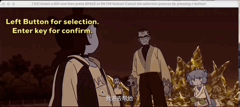
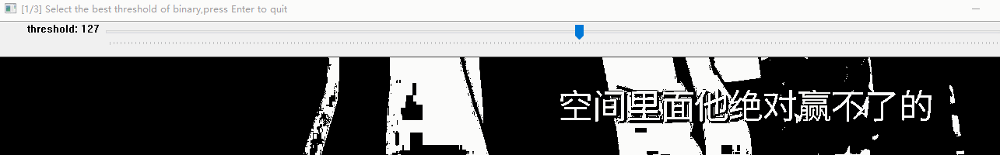
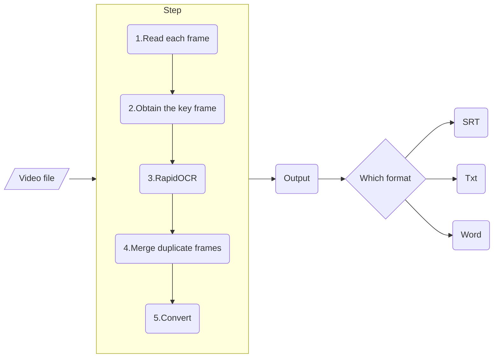

<div align="center">
   
</div>
<br/>

---

简体中文 | [English](./docs/README_en.md)

<p align="left">
    <a href="">=3.7,<=3.10-aff.svg"></a>
    <a href=""></a>
    <a href="https://pypi.org/project/rapid-videocr/"></a>
    <a href="https://github.com/SWHL/RapidVideOCR/stargazers"></a>
    <a href="https://pypi.org/project/rapid-videocr/"></a>
</p>

📌当前最新版本存在内存泄漏问题，处理大一些的视频会出现卡死机器情况，目前正在修复中，详情可参见分支

<details>
    <summary>目录</summary>

- [简介](#简介)
- [更新日志（more）](#更新日志more)
  - [🎄2022-12-04 update:](#2022-12-04-update)
  - [✨2022-06-26 update:](#2022-06-26-update)
- [使用步骤](#使用步骤)
- [`config_videocr.yaml`中相关参数](#config_videocryaml中相关参数)
- [整体框架](#整体框架)
- [常见问题 FAQ](#常见问题-faq)
- [视频OCR动态](#视频ocr动态)
- [未来的应用场景探索](#未来的应用场景探索)
- [耗时基准](#耗时基准)
- [仓库分支说明](#仓库分支说明)

</details>

### 简介
- 视频硬字幕提取，自动生成对应srt和带有关键帧的docx文件。
- 支持字幕语言：中文 | 英文 （其他可以支持的语言参见：[支持语种列表](https://github.com/PaddlePaddle/PaddleOCR/blob/release/2.1/doc/doc_ch/multi_languages.md#%E8%AF%AD%E7%A7%8D%E7%BC%A9%E5%86%99))
- 可加入QQ群：**706807542**
- 更快更准确地提取视频硬字幕，并提供`txt|SRT|docx`三种格式的输出。
  - **更快**：采用[decord](https://github.com/dmlc/decord)作为读取视频的库，更快; 对于输入视频，只提取字幕关键帧。
  - **更准**：采用[RapidOCR](https://github.com/RapidAI/RapidOCR)作为识别库。
  - **更方便**：pip直接安装即可使用。

### 更新日志（[more](./docs/change_log.md)）
#### 🎄2022-12-04 update:
- 添加交互式框定字幕位置功能，默认开启，更加好用，详情可参考下面的GIF图。感谢@[Johndirr](https://github.com/Johndirr)的建议。
- 优化代码结构，将RapidOCR相关模型和配置文件放到`rapidocr`目录下
- `rapidvideocr`的配置文件也放到对应目录下

#### ✨2022-06-26 update:
- 参数化配置相关参数，包括`rapid_ocr`和`rapid_videocr`两部分，更加灵活


### 使用步骤
1. 安装`rapid_videocr`包
   ```bash
   $ pip install rapid_videocr
   ```

2. 运行
   1. 执行代码
      ```bash
      $ python demo.py

      # 或者
      $ rapid_videocr --mp4_path assets/test_video/2.mp4
      ```
   2. 选择字幕区域，鼠标按住左键框选字幕所在区域，不要只框选文字，尽量框选文字所在的行区域
      <div align="center">
           
      </div>

   3. 选择合适的二值化阈值，左右滑动滑块，使得下面图中文字清晰显示，按`Enter`确认，需要选择三次。具体操作如下GIF所示：
       
   4. 输出日志如下：
      ```text
      Loading assets/test_video/2.mp4
      Get the key frame: 100%|██████| 71/71 [00:03<00:00, 23.46it/s]
      Extract content: 100%|██████| 4/4 [00:03<00:00,  1.32it/s]
      The srt has been saved in the assets\test_video\2.srt.
      The txt has been saved in the assets\test_video\2.txt.
      The docx has been saved in the assets\test_video\2.docx.
      ```

3. 可以去**video所在目录**查看输出的文件


### [`config_videocr.yaml`](./rapid_videocr/config_videocr.yaml)中相关参数
|参数名称|默认值|取值范围|含义|
|:---|:---|:---|:---|
|`is_dilate`|`True`|`bool`|是否腐蚀字幕所在背景图像|
|`error_num`|`0.005`|`[0, 1]`， default:0.005|值越小，两张图之间差异点会更敏感|
|`output_format`|`all`|`['txt', 'srt', 'docx', 'all']`|输出最终字幕文件，`all`前面三个格式都输出|
|`time_start`|`00:00:00`|开始提取字幕的起始时间点|开始提取字幕的起始时间点, 示例：'00:00:00'|
|`time_end`|`-1`|开始提取字幕的起始时间点|需要大于`time_start`，`-1`表示到最后， 示例：'-1'|

### 整体框架


### 常见问题 [FAQ](./docs/FAQ.md)

### 视频OCR动态
- [(ICCV 2021) STRIVE: Scene Text Replacement In videos.](https://openaccess.thecvf.com/content/ICCV2021/papers/G_STRIVE_Scene_Text_Replacement_in_Videos_ICCV_2021_paper.pdf)
	- 使用时空转换网络将所有帧中的文字矫正
	- 使用图片中文字编辑的方法替换单一参考帧中的文字，并且使用时空转换网络还原矫正的文字
	- 提供了一个视频文本编辑的数据集
- [【NeurIPS2021】A Bilingual, OpenWorld Video Text Dataset and End-to-end Video Text Spotter with Transformer](https://arxiv.org/abs/2112.04888) | [博客解读](https://blog.csdn.net/shiwanghualuo/article/details/122712872?spm=1001.2014.3001.5501)
- [【ACM MM 2019】You only recognize once: Towards fast video text spotting](https://arxiv.org/pdf/1903.03299)

### 未来的应用场景探索
- [ ] 基于视频文本OCR的视频内容理解，结合图像特征+图像中文本特征
- [ ] 视频字幕自动翻译 → 接入百度翻译API，直接做视频字幕转译，参考[论文](https://mp.weixin.qq.com/s/2CZvwqiR8Mg5T7r4P67BRw) → 这个经过调研，目前市场相关软件已经很多，无力再造轮子
- [ ] 基于视频文本特征的视频检索
- [ ] 自动擦除指定字幕/擦除指定文本内容

### 耗时基准
|配置|测试MP4|总帧数|每帧大小|耗时(s)|
|:---|:---|:---|:---|:---|
|`Intel(R) Core(TM) i7-6700 CPU @3.40GHz 3.41 GHz`|`assets/test_video/2.mp4`|71|1920x800|4.681s|
|`Intel(R) Core(TM) i5-4210M CPU @2.60GHz 2.59 GHz`|`assets/test_video/2.mp4`|71|1920x800|6.832s|

### 仓库分支说明
- `add_remove_bg_module`:
  - 基于图像分割UNet算法来去除字幕图像背景图，只剩下文字内容，训练对应代码为[pytorch-unet](https://github.com/SWHL/pytorch-unet)
  - 没有并入主仓库原因：模型较大，处理速度较慢，同时泛化性能不是太好，有提升空间，可自行探索。
- `add_asr_module`:
  - 推理代码来源：[RapidASR](https://github.com/RapidAI/RapidASR/tree/main/python/base_paddlespeech)
  - 没有并入主仓库原因：处理速度较慢，配置环境复杂，效果较差，有提升空间，可自行探索。
