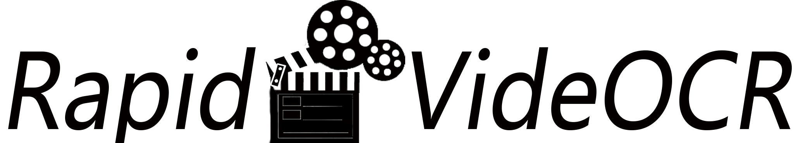

<div align="center">
   
</div>
<br/>

---

简体中文 | [English](./README_en.md)

<p align="left">
    <a href="https://colab.research.google.com/github/SWHL/RapidVideOCR/blob/main/RapidVideOCR.ipynb" target="_blank"></a>
    <a href="./LICENSE"></a>
    <a href=""></a>
    <a href=""></a>
</p>

- 支持字幕语言：中文|英文
- 想法源自[videocr](https://github.com/apm1467/videocr)
- 可加入QQ群：**706807542**
- 更快更准确地提取内嵌在视频的字幕，并提供`txt|SRT|docx`三种格式
  - **更快**：
    - 采用[Decord](https://github.com/dmlc/decord)作为读取视频的库，更快;对于整个输入的视频，并不全部提取，因为存在大量重复字幕内容；
    - 这里采用预先找到出现不同字幕的关键帧，再送入OCR部分，因此更快
  - **更准**：整个项目完全为全离线CPU运行，OCR部分采用的是[RapidOCR](https://github.com/RapidAI/RapidOCR)，模型均来自PaddleOCR
  - **更方便**：采用大小仅为2M左右的ONNXRuntime推理引擎，不安装PaddlePaddle框架，部署更加方便
- 🐱如果识别的字幕为纯英文字幕，可以在`main.py`中更改只识别英文和数字的模型，来达到更好的效果。
  ```python
  det_model_path = "resources/models/ch_PP-OCRv2_det_infer.onnx"
  cls_model_path = "resources/models/ch_ppocr_mobile_v2.0_cls_infer.onnx"
  rec_model_path = "resources/models/en_number_mobile_v2.0_rec_infer.onnx"
  dict_path = "resources/en_dict.txt"
  ```

### 视频OCR学术动态
- [【NeurIPS2021】A Bilingual, OpenWorld Video Text Dataset and End-to-end Video Text Spotter with Transformer](https://arxiv.org/abs/2112.04888) | [博客解读](https://blog.csdn.net/shiwanghualuo/article/details/122712872?spm=1001.2014.3001.5501)
- [【ACM MM 2019】You only recognize once: Towards fast video text spotting](https://arxiv.org/pdf/1903.03299)

### 未来的应用场景探索
- 基于视频文本OCR的视频内容理解，结合图像特征+图像中文本特征
- 视频字幕自动翻译
- 基于视频文本特征的视频检索

### 更新日志
<details>
   
- [x] 背景去除效果不好，导致丢失某些帧
  - 尝试采用图像分割的方法，经过测试，CPU下推理速度太慢，暂时放弃
  - 目前采用的固定的二值化阈值
- [x] (2021-12-14)完善对应的英文文档
- [x] (2021-12-14)添加运行耗时基准
- [x] 添加具体参数说明
- [x] 制作项目Logo
- [ ] 更多的测试
</details>


### 耗时基准
|配置|测试MP4|总帧数|每帧大小|耗时(s)|
|:---:|:---:|:---:|:---:|:---:|
|`Intel(R) Core(TM) i7-6700 CPU @3.40GHz 3.41 GHz`|`assets/test_video/2.mp4`|71|1920x800|4.681s|
|`Intel(R) Core(TM) i5-4210M CPU @2.60GHz 2.59 GHz`|`assets/test_video/2.mp4`|71|1920x800|6.832s|


### 使用步骤
1. 下载RapidOCR使用的识别模型和字典文件([百度网盘:drf1](https://pan.baidu.com/s/103kx0ABtU7Lif57cv397oQ) | [Google Drive](https://drive.google.com/drive/folders/1cjfawIhIP0Yq7_HjX4wtr_obcz7VTFtg?usp=sharing))

2. 将下载好的`models`目录和`ppocr_keys_v1.txt`放到`resources`下，具体目录如下：
   ```text
   resources
      |-- models
      |-- ch_mobile_v2.0_rec_infer.onnx
      |-- ch_PP-OCRv2_det_infer.onnx
      |-- ch_ppocr_mobile_v2.0_cls_infer.onnx
      |-- en_number_mobile_v2.0_rec_infer.onnx
      |-- ppocr_keys_v1.txt
      `-- en_dict.txt
   ```

3. 搭建运行环境
   - 推荐Windows,整个项目目前只在Windows下测试过
   - 安装相应的包
      ```bash
      cd RapidVideOCR

      pip install -r requirements.txt -i https://pypi.douban.com/simple/
      ```
   - 也可以在[Google Colab](https://colab.research.google.com/github/SWHL/RapidVideOCR/blob/main/RapidVideOCR.ipynb)下快速查看运行Demo。

4. 运行
   - 代码
      ```bash
      cd RapidVideOCR

      python main.py
      ```
   - 输出日志如下：
     ```text
     Loading assets/test_video/2.mp4
     Get the key frame: 100%|██████| 71/71 [00:03<00:00, 23.46it/s]
     Extract content: 100%|██████| 4/4 [00:03<00:00,  1.32it/s]
     The srt has been saved in the assets\test_video\2.srt.
     The txt has been saved in the assets\test_video\2.txt.
     The docx has been saved in the assets\test_video\2.docx.
     ```

5. 可以去**video所在目录**查看输出的文件


### `main.py`中相关参数
|参数名称|取值范围|含义|
|:---:|:---:|:---:|
|batch_size|[1, all_frames]|获取关键帧时，批量比较的batch大小，理论上，越大越快|
|is_dilate|bool|是否腐蚀字幕所在背景图像|
|subtitle_height|default:None|字幕文本的高度,默认自动获取|
|error_num|[0, 1]， default:0.005|值越小，两张图之间差异点会更敏感|
|output_format|['txt', 'srt', 'docx', 'all']|输出最终字幕文件，`all`前面三个格式都输出|
|time_start|整个视频所有的时间点|开始提取字幕的起始时间点|
|time_end|整个视频所有的时间点,大于time_start, -1表示到最后|结束提取字幕的终止时间点|
