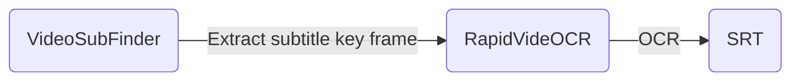

[简体中文](https://github.com/SWHL/RapidVideOCR/blob/main/docs/README_zh.md) | English

   

 

    
    <a href="">=3.6,<3.12-aff.svg"></a>
    
    
    
    
    
    
    

    
Contents

- [Introduction](#introduction)
- [Overall framework](#overall-framework)
- [Use](#use)
- [Change log (more)](#change-log-more)
- [Announce](#announce)

### Introduction
- Video hard subtitle extraction, automatically generate the corresponding `srt | txt` file.
- Supported subtitle languages: Chinese | English (For other supported languages, see: [List of supported languages](https://github.com/PaddlePaddle/PaddleOCR/blob/release/2.1/doc/doc_ch/multi_languages.md#%E8%AF%AD%E7%A7%8D%E7%BC%A9%E5%86%99))
- Extract video hard subtitles faster and more accurately, and provide output in two formats `srt|txt`:
   - **Faster**: Combined with [VideoSubFinder](https://sourceforge.net/projects/videosubfinder/) software, extraction of key subtitle frames is faster.
   - **More accurate**: [RapidOCR](https://github.com/RapidAI/RapidOCR) is used as the recognition library.
   - **More convenient**: pip can be used directly after installation.
- **This tool is under development. During use, if you encounter any problems, please submit an issue or join the group for feedback. If you don't want to use it, just don't use it, don't affect your mood.**
- If it helps you, please give a little star ⭐ or sponsor a cup of coffee (click the link in Sponsor at the top of the page).

### Overall framework

### Use
- [☆ RapidVideOCR Primary Tutorial (Interface version, download and decompress)](https://github.com/SWHL/RapidVideOCR/wiki/RapidVideOCR%E5%88%9D%E7%BA%A7%E6%95%99%E7%A8%8B%EF%BC%88%E7%95%8C%E9%9D%A2%E7%89%88-%E4%B8%8B%E8%BD%BD%E8%A7%A3%E5%8E%8B%E4%BD%BF%E7%94%A8%EF%BC%89)
- [☆☆ RapidVideOCR Intermediate Tutorial (Python Xiaobai)](https://github.com/SWHL/RapidVideOCR/wiki/RapidVideOCR%E4%B8%AD%E7%BA%A7%E6%95%99%E7%A8%8B%EF%BC%88python%E5%B0%8F%E7%99%BD%EF%BC%89)
- [☆☆☆ RapidVideOCR Advanced Tutorial (Partners with python foundation)](https://github.com/SWHL/RapidVideOCR/wiki/RapidVideOCR%E9%AB%98%E7%BA%A7%E6%95%99%E7%A8%8B%EF%BC%88%E6%9C%89python%E5%9F%BA%E7%A1%80%E7%9A%84%E5%B0%8F%E4%BC%99%E4%BC%B4%EF%BC%89)

### Change log ([more](https://github.com/SWHL/RapidVideOCR/wiki/Changelog))
- ♦ 2023-08-05 v2.2.4~2.2.6 update:
  - Fixed index error in concat_rec_mode.
  - Add logging module for easy feedback.
- 🛶 2023-07-19 v2.2.3 update:
    - Increase the adaptation of VSF parameters. During command line mode and class initialization, it is possible to specify parameters with the same name for VSF commands.
- 🤓2023-07-08 v2.2.2 update:
   - Fixed the problem that the Chinese path could not be read during batch recognition
   - Skip issue in SRT when fixing missing axes. At present, when a certain axis fails to be recognized, the position will be vacated, which is convenient for proofreading.
   - Keep the vsf results.

### Announce
For international developers, we regard [Discussions](https://github.com/SWHL/RapidVideOCR/discussions) as our international community platform. All ideas and questions can be discussed here in English.