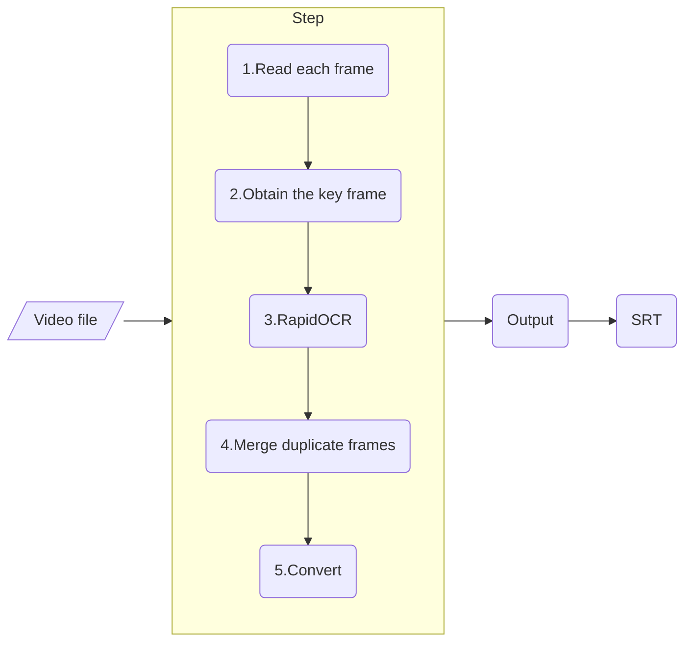

<div align="center">
   
</div>
<br/>


简体中文 | [English](./docs/README_en.md)

<p align="left">
    <a href="">=3.7,<=3.10-aff.svg"></a>
    <a href=""></a>
    <a href="https://pypi.org/project/rapid-videocr/"></a>
    <a href="https://github.com/SWHL/RapidVideOCR/stargazers"></a>
    <a href="https://pypi.org/project/rapid-videocr/"></a>
</p>

<details>
    <summary>目录</summary>

- [简介](#简介)
- [更新日志（more）](#更新日志more)
  - [👊 2023-01-15 v1.1.4 update:](#-2023-01-15-v114-update)
  - [🌈2023-01-10 v1.0.3 update:](#2023-01-10-v103-update)
- [使用步骤](#使用步骤)
- [`config_videocr.yaml`中相关参数](#config_videocryaml中相关参数)
- [整体框架](#整体框架)
- [常见问题 FAQ](#常见问题-faq)
- [视频OCR动态](#视频ocr动态)
- [未来的应用场景探索](#未来的应用场景探索)
- [耗时基准](#耗时基准)
- [仓库分支说明](#仓库分支说明)

</details>

### 简介
- 视频硬字幕提取，自动生成对应`srt`文件。
- 支持字幕语言：中文 | 英文 （其他可以支持的语言参见：[支持语种列表](https://github.com/PaddlePaddle/PaddleOCR/blob/release/2.1/doc/doc_ch/multi_languages.md#%E8%AF%AD%E7%A7%8D%E7%BC%A9%E5%86%99))
- 可加入QQ群：**706807542**
- 更快更准确地提取视频硬字幕，并提供`srt`三种格式的输出：
  - **更快**：~~采用[decord](https://github.com/dmlc/decord)作为读取视频的库，更快;~~ 改用OpenCV实现，低内存占用。对于输入视频，只提取字幕关键帧。
  - **更准**：采用[RapidOCR](https://github.com/RapidAI/RapidOCR)作为识别库。
  - **更方便**：pip直接安装即可使用。

### 更新日志（[more](./docs/change_log.md)）
#### 👊 2023-01-15 v1.1.4 update:
- 添加输出txt格式的选项，目前v1.1.4版本默认输出srt和txt两种格式
- 添加根据运行程序屏幕大小，调节选择字幕的框大小

#### 🌈2023-01-10 v1.0.3 update:
- 将decord替换为OpenCV，因为decord处理MP4时，存在内存泄漏问题。详情参见：[#208](https://github.com/dmlc/decord/issues/208)


### 使用步骤
1. 安装`rapid_videocr`包
   ```bash
   $ pip install rapid_videocr
   ```

2. 运行
    - 脚本执行
        ```python
        from rapid_videocr import RapidVideOCR

        extractor = RapidVideOCR()

        mp4_path = 'assets/test_video/2.mp4'

        # out_format: ['srt', 'txt', 'all']，默认是all
        ocr_result = extractor(mp4_path, out_format='srt')
        print(ocr_result)

        # output:
        # [
        #     [0, '00:00:00,041', '00:00:00,416', '空间里面他绝对赢不了的'],
        #     [10, '00:00:00,458', '00:00:01,166', '我进去帮他'],
        #     [37, '00:00:01,583', '00:00:02,541', '你们接着善后']
        # ]
        ```
    - 命令行执行
      - Usage:
        ```bash
        $ rapid_videocr -h
        usage: rapid_videocr [-h] [-mp4 MP4_PATH] [-o {srt,txt,all}]

        optional arguments:
        -h, --help            show this help message and exit
        -mp4 MP4_PATH, --mp4_path MP4_PATH
                                The full path of mp4 video.
        -o {srt,txt,all}, --out_format {srt,txt,all}
                                Output file format. Default is "all"
        ```
      - 示例：
        ```bash
        $ rapid_videocr -o srt -mp4 assets/test_video/2.mp4
        ```

3. 选择字幕区域，鼠标按住左键框选字幕所在区域，不要只框选文字，尽量框选文字所在的行区域
   <div align="center">
        
   </div>

4. 选择合适的二值化阈值，左右滑动滑块，使得下面图中文字清晰显示，按`Enter`确认，需要选择三次。具体操作如下GIF所示：

    
5. 输出日志如下：
   ```text
    Select a ROI and then press SPACE or ENTER button!
    Cancel the selection process by pressing c button!
    Select a ROI and then press SPACE or ENTER button!
    Cancel the selection process by pressing c button!
    Select a ROI and then press SPACE or ENTER button!
    Cancel the selection process by pressing c button!
    Obtain key frame: 100%|██████████████████| 71/71 [00:03<00:00, 19.19frame/s]
    OCR: 100%|███████████████████████████| 5/5 [00:03<00:00,  1.40frame/s]
    The file has been saved in the assets\test_video\2.txt
    [[0, '00:00:00,041', '00:00:00,416', '空间里面他绝对赢不了的'], [10, '00:00:00,458', '00:00:01,166', '我进去帮他'], [37, '00:00:01,583', '00:00:02,541', '你们接着善后']]
    elapse: 16.00002384185791s
   ```

6. 可以去**video所在目录**查看输出的文件


### [`config_videocr.yaml`](./rapid_videocr/config_videocr.yaml)中相关参数
|参数名称|默认值|取值范围|含义|
|:---|:---|:---|:---|
|`is_dilate`|`True`|`bool`|是否腐蚀字幕所在背景图像|
|`error_thr`|`0.005`|`[0, 1]`， default:0.005|值越小，两张图之间差异点会更敏感|
|`time_start`|`00:00:00`|开始提取字幕的起始时间点|开始提取字幕的起始时间点, 示例：'00:00:00'|
|`time_end`|`-1`|开始提取字幕的起始时间点|需要大于`time_start`，`-1`表示到最后， 示例：'-1'|

### 整体框架


### 常见问题 [FAQ](./docs/FAQ.md)

### 视频OCR动态
- [(ICCV 2021) STRIVE: Scene Text Replacement In videos.](https://openaccess.thecvf.com/content/ICCV2021/papers/G_STRIVE_Scene_Text_Replacement_in_Videos_ICCV_2021_paper.pdf)
	- 使用时空转换网络将所有帧中的文字矫正
	- 使用图片中文字编辑的方法替换单一参考帧中的文字，并且使用时空转换网络还原矫正的文字
	- 提供了一个视频文本编辑的数据集
- [【NeurIPS2021】A Bilingual, OpenWorld Video Text Dataset and End-to-end Video Text Spotter with Transformer](https://arxiv.org/abs/2112.04888) | [博客解读](https://blog.csdn.net/shiwanghualuo/article/details/122712872?spm=1001.2014.3001.5501)
- [【ACM MM 2019】You only recognize once: Towards fast video text spotting](https://arxiv.org/pdf/1903.03299)

### 未来的应用场景探索
- [ ] 基于视频文本OCR的视频内容理解，结合图像特征+图像中文本特征
- [ ] 视频字幕自动翻译 → 接入百度翻译API，直接做视频字幕转译，参考[论文](https://mp.weixin.qq.com/s/2CZvwqiR8Mg5T7r4P67BRw) → 这个经过调研，目前市场相关软件已经很多，无力再造轮子
- [ ] 基于视频文本特征的视频检索
- [ ] 自动擦除指定字幕/擦除指定文本内容

### 耗时基准
|配置|测试MP4|总帧数|每帧大小|耗时(s)|
|:---|:---|:---|:---|:---|
|`Intel(R) Core(TM) i7-6700 CPU @3.40GHz 3.41 GHz`|`assets/test_video/2.mp4`|71|1920x800|15s|

### 仓库分支说明
- `add_remove_bg_module`:
  - 基于图像分割UNet算法来去除字幕图像背景图，只剩下文字内容，训练对应代码为[pytorch-unet](https://github.com/SWHL/pytorch-unet)
  - 没有并入主仓库原因：模型较大，处理速度较慢，同时泛化性能不是太好，有提升空间，可自行探索。
