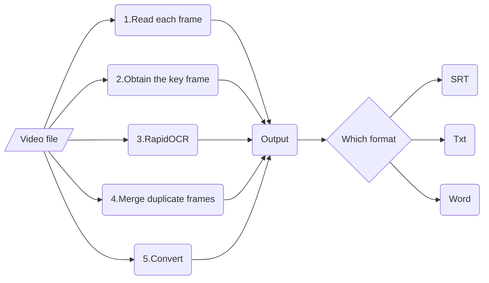

<div align="center">
   
</div>
<br/>

---

[简体中文](../README.md) | English

<p align="left">
    <a href="https://colab.research.google.com/github/SWHL/RapidVideOCR/blob/main/RapidVideOCR.ipynb" target="_blank"></a>
    <a href="./LICENSE"></a>
    <a href=""></a>
    <a href=""></a>
</p>

- Support subtitle language: Chinese | English | Japanese
- Drive from [videocr](https://github.com/apm1467/videocr)
- Extract subtitles embedded in the video faster and more accurately, and provide three formats of `txt|SRT|docx`
  - **Faster**:
    - Adapted the [Decord](https://github.com/dmlc/decord), which is dedicated to processing videos.
    - Only extract the key frames of the whole video.
  - **More accurately**:
    - The entire project is completely offline CPU running.
    - The OCR part is from [RapidOCR](https://github.com/RapidAI/RapidOCR), relying on the [PaddleOCR](https://github.com/PaddlePaddle/PaddleOCR/).

- 🐱If you want to recognize **English, Japanese** subtitles, you can change the corresponding model and dictionary file in [`config_ocr.yaml`](./config_ocr.yaml) to change the corresponding model and dictionary files.
  - English
    ```yaml
     Rec:
         module_name: ch_ppocr_v2_rec
         class_name: TextRecognizer
         model_path: resources/models/en_number_mobile_v2. 0_rec_infer.onnx

         rec_img_shape: [3, 32, 320]
         rec_batch_num: 6
         keys_path: resources/rapid_ocr/en_dict.txt
    ```

  - Japanese
    ```yaml
    Rec:
        module_name: ch_ppocr_v2_rec
        class_name: TextRecognizer
        model_path: resources/rapid_ocr/models/japan_rec_crnn.onnx

        rec_img_shape: [3, 32, 320]
        rec_batch_num: 6
        keys_path: resources/rapid_ocr/japan_dict.txt
    ```

### Change log
### ✨2022-06-26 update:
- Parameterized configuration of relevant parameters, including `rapid_ocr` and `rapid_videocr` parts, more flexible

#### 🌼2022-05-08 update
- Add an interactive operation to determine the threshold value of the binarized subtitle image, only supports Windows system, can be used by `is_select_threshold = True`
- Optimized code

#### 🎉2022-05-03 update
- Add GPU support, see the specific configuration tutorial: [onnxruntime-gpu version inference configuration](https://github.com/RapidAI/RapidOCR/blob/main/python/onnxruntime_infer/README.md#onnxruntime-gpu%E7%89%88%E6%8E%A8%E7%90%86%E9%85%8D%E7%BD%AE)
- Added support for Japanese, more languages can be supported, see: [List of supported languages](https://github.com/PaddlePaddle/PaddleOCR/blob/release/2.1/doc/doc_ch/multi_languages.md#%E8%AF%AD%E7%A7%8D%E7%BC%A9%E5%86%99)

#### 💡2022-05-01 update:
- Add the speech recognition module. Since the decoding part of this module can only run on Linux and Mac, if you want to use this module, please use Linux and Mac.
- The current speech recognition code comes from the [RapidASR/python](https://github.com/RapidAI/RapidASR/tree/main/python/base_paddlespeech) section. Model from [PaddleSpeech](https://github.com/PaddlePaddle/PaddleSpeech/tree/develop/examples/aishell/asr0).
- After a simple test, the voice recognition module is not too accurate. -_-!

#### 2022-03-09 update:
- Add [FAQ]((./docs/FAQ.md)) module.

#### 2021-12-14 update:
  - [x] Add specific parameter descrition.
  - [x] Make the project logo.
  - [x] Add sample vidoe to run time-consuming benchmark.

### Overall Framework


### [FAQ](./docs/FAQ.md)


### Video OCR Research
- [【NeurIPS2021】A Bilingual, OpenWorld Video Text Dataset and End-to-end Video Text Spotter with Transformer](https://arxiv.org/abs/2112.04888)
- [【ACM MM 2019】You only recognize once: Towards fast video text spotting](https://arxiv.org/pdf/1903.03299)


### The benchmark of costing time

|Env|Test MP4| Total Frames | Frame Size|Cost(s/f)|
|:---:|:---:|:---:|:---:|:---:|
|`Intel(R) Core(TM) i7-6700 CPU @3.40GHz 3.41 GHz`|`assets/test_video/2.mp4`|71|1920x800|4.681s|
|`Intel(R) Core(TM) i5-4210M CPU @2.60GHz 2.59 GHz`|`assets/test_video/2.mp4`|71|1920x800|6.832s|


### Use
1. Download the OCR models and dictionary keys used by RapidOCR. ([Baidu](https://pan.baidu.com/s/1SFVxSS2rDtmjZfP_9iTHIw?pwd=trqi) | [Google Drive](https://drive.google.com/drive/folders/1cX8fbVe4_pCNI98QBIYOp09hU6aGWSZL?usp=sharing))

2. Put the downloaded `rapid_ocr` under the `resources`, the specific directories are as follows:
   ```text
   resources/
   └── rapid_ocr
      ├── en_dict.txt
      ├── models
      │   ├── ch_mobile_v2.0_rec_infer.onnx
      │   ├── ch_ppocr_mobile_v2.0_cls_infer.onnx
      │   └── ch_PP-OCRv2_det_infer.onnx
      └── ppocr_keys_v1.txt
   ```

3. Install the run envirement.
   - Recommend the Window OS, because the entire project has only been tested under Windows now.
   - Install the relative packages as follows.
      ```bash
      cd RapidVideOCR

      pip install -r requirements.txt -i https://pypi.douban.com/simple/
      ```

4. Run
   - The code:
      ```bash
      cd RapidVideOCR

      python main.py
      ```
   - The binarization threshold can be interactively selected when the OS is Windows and the parameter `is_select_threshold=True`
     - Slide the slider left and right, so that the text in the following figure is clearly displayed, press `Enter` to exit, you need to select three times
     - For example：
       
    - The output log is as follows：
        ```text
        Loading assets/test_video/2.mp4
        Get the key point: 100%|██████| 71/71 [00:03<00:00, 23.46it/s]
        Extract content: 100%|██████| 4/4 [00:03<00:00,  1.32it/s]
        The srt has been saved in the assets\test_video\2.srt.
        The txt has been saved in the assets\test_video\2.txt.
        The docx has been saved in the assets\test_video\2.docx.
        ```
   - Also run on the [Google Colab](https://colab.research.google.com/github/SWHL/RapidVideOCR/blob/main/RapidVideOCR.ipynb).

5. Look the output files where the video is located.

### [`config_videocr.yaml`](./config_videocr.yaml) in the relevant parameters
|parameter name|value range|meaning|
|:---|:---|:---|
|`batch_size`|`[1, all_frames]`|The size of the batch to compare when getting keyframes, in theory, the bigger the faster|
|`is_dilate`|`bool`|Whether to erode the background image of the caption|
|`is_select_threshold`|`bool`|whether to interactively select binary values|
|`subtitle_height`|`default:None`|The height of the subtitle text, which is automatically obtained by default
|`error_num`|`[0, 1]`, default:0.005|The smaller the value, the more sensitive the difference between the two graphs|
|`output_format`|`['txt', 'srt', 'docx', 'all']`|output the final caption file, `all` the previous three formats are output|
|`time_start`|start extracting the start time of the subtitle|start extracting the start time of the subtitle, example: '00:00:00'|
|`time_end`|the start point of the subtitle extraction| needs to be greater than `time_start`, `-1` means to the end, example: '-1'|
