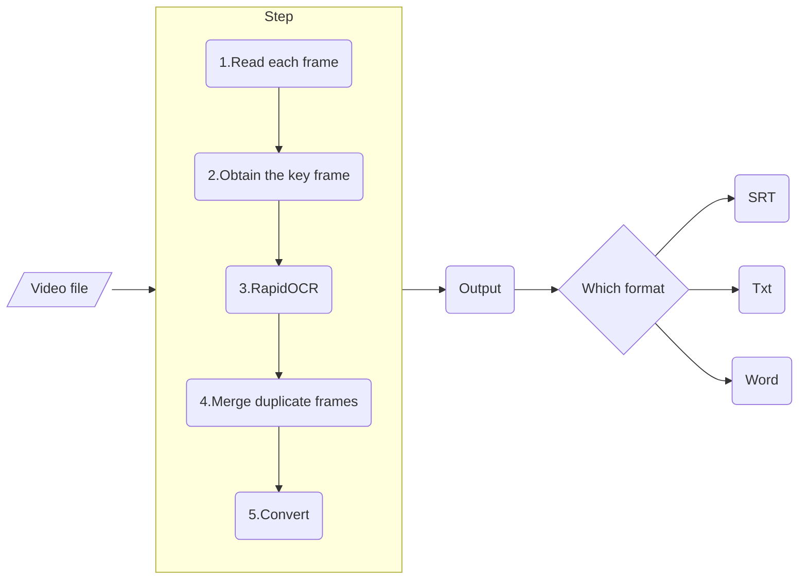

<div align="center">
   
</div>
<br/>

---

[简体中文](../README.md) | English

<p align="left">
    <a href="">=3.7,<=3.10-aff.svg"></a>
    <a href=""></a>
    <a href="https://pypi.org/project/rapid-videocr/"></a>
    <a href="https://github.com/SWHL/RapidVideOCR/stargazers"></a>
</p>


<details>
    <summary>Contents</summary>

- [Introduction](#introduction)
- [Change log (more)](#change-log-more)
  - [🎄2022-12-04 update:](#2022-12-04-update)
  - [✨2022-06-26 update:](#2022-06-26-update)
- [Use](#use)
- [`config_videocr.yaml` in the relevant parameters](#config_videocryaml-in-the-relevant-parameters)
- [Overall Framework](#overall-framework)
- [FAQ](#faq)
- [Video OCR Research](#video-ocr-research)
- [The benchmark of costing time](#the-benchmark-of-costing-time)
- [Other branch description](#other-branch-description)

</details>

### Introduction
- Video hard subtitle extraction, automatically generating corresponding srt and docx files with key frames.
- Support subtitle language: Chinese | English
- Extract subtitles embedded in the video faster and more accurately, and provide three formats of `txt|SRT|docx`
  - **Faster**: adapted the [decord](https://github.com/dmlc/decord), which is dedicated to processing videos.
  - **More accurately**: adapted [RapidOCR](https://github.com/RapidAI/RapidOCR).
  - **More convenient**: use by installing the package with pip tool.

### Change log ([more](./change_log_en.md))
#### 🎄2022-12-04 update:
- Add the function of interactively framing the subtitle position, which is enabled by default and is more useful. For details, please refer to the GIF image below. Thanks to @[Johndirr](https://github.com/Johndirr) for the suggestion.
- Optimize the code structure, put RapidOCR related models and configuration files in the `rapidocr` directory
- The configuration file of `rapidvideocr` is also placed in the corresponding directory.

#### ✨2022-06-26 update:
- Parameterized configuration of relevant parameters, including `rapid_ocr` and `rapid_videocr` parts, more flexible


### Use
1. Install the `rapid_videocr` package.
   ```bash
   $ pip install rapid_videocr
   ```

2. Run
   1. Run the code:
      ```bash
      $ python main.py

      # or
      $ rapid_videocr --mp4_path assets/test_video/2.mp4
      ```
   2. Select the subtitle area, press the main left button of the mouse to frame the area where the subtitle is located, don't just select the text, try to select the row area where the text is located:<br/>
      

   3. Select an appropriate binarization threshold, slide the slider left and right, so that the text in the figure below is clearly displayed, press `Enter` to confirm, you need to select three times. The specific operation is shown in the following GIF:
        
   4. The output log is as follows：
        ```text
        Loading assets/test_video/2.mp4
        Get the key point: 100%|██████| 71/71 [00:03<00:00, 23.46it/s]
        Extract content: 100%|██████| 4/4 [00:03<00:00,  1.32it/s]
        The srt has been saved in the assets\test_video\2.srt.
        The txt has been saved in the assets\test_video\2.txt.
        The docx has been saved in the assets\test_video\2.docx.
        ```

3. Look the output files where the video is located.

### [`config_videocr.yaml`](./config_videocr.yaml) in the relevant parameters
|Parameter Name|Default|Value Range|Note|
|:---|:---|:---|:---|
|`is_dilate`|`True`|`bool`|Whether to erode the background image of the caption|
|`error_num`|`0.005`|`[0, 1]`, default:0.005|The smaller the value, the more sensitive the difference between the two graphs|
|`output_format`|`all`|`['txt', 'srt', 'docx', 'all']`|output the final caption file, `all` the previous three formats are output|
|`time_start`|`00:00:00`|start extracting the start time of the subtitle|start extracting the start time of the subtitle, example: '00:00:00'|
|`time_end`|`-1`|the start point of the subtitle extraction| needs to be greater than `time_start`, `-1` means to the end, example: '-1'|


### Overall Framework


### [FAQ](./docs/FAQ.md)


### Video OCR Research
- [【NeurIPS2021】A Bilingual, OpenWorld Video Text Dataset and End-to-end Video Text Spotter with Transformer](https://arxiv.org/abs/2112.04888)
- [【ACM MM 2019】You only recognize once: Towards fast video text spotting](https://arxiv.org/pdf/1903.03299)


### The benchmark of costing time

|Env|Test MP4| Total Frames | Frame Size|Cost(s/f)|
|:---|:---|:---|:---|:---|
|`Intel(R) Core(TM) i7-6700 CPU @3.40GHz 3.41 GHz`|`assets/test_video/2.mp4`|71|1920x800|4.681s|
|`Intel(R) Core(TM) i5-4210M CPU @2.60GHz 2.59 GHz`|`assets/test_video/2.mp4`|71|1920x800|6.832s|

### Other branch description
- `add_remove_bg_module`:
   - Based on the image segmentation UNet algorithm to remove the background image of the subtitle image, leaving only the text content, the corresponding training code is [pytorch-unet](https://github.com/SWHL/pytorch-unet)
   - The reason for not merging into the main warehouse: the model is large, the processing speed is slow, and the generalization performance is not very good, there is room for improvement, and you can explore by yourself.
- `add_asr_module`:
   - Reasoning code source: [RapidASR](https://github.com/RapidAI/RapidASR/tree/main/python/base_paddlespeech)
   - Reasons for not being merged into the main warehouse: slow processing speed, complex configuration environment, poor effect, and room for improvement, you can explore by yourself.
