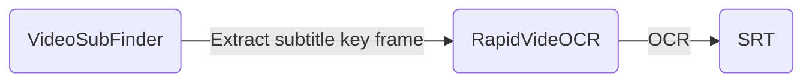

English | [简体中文](https://github.com/SWHL/RapidVideOCR/blob/main/README.md)

   

 

    
    <a href="">=3.7,<=3.10-aff.svg"></a>
    
    
    
    
    
    

    
Contents

- [Introduction](#introduction)
- [Overall framework](#overall-framework)
- [Use](#use)
- [Change log (more)](#change-log-more)
- [Announce](#announce)

### Introduction
- Video hard subtitle extraction, automatically generate the corresponding `srt | txt` file.
- Supported subtitle languages: Chinese | English (For other supported languages, see: [List of supported languages](https://github.com/PaddlePaddle/PaddleOCR/blob/release/2.1/doc/doc_ch/multi_languages.md#%E8%AF%AD%E7%A7%8D%E7%BC%A9%E5%86%99))
- You can join the QQ group: **706807542**
- Extract video hard subtitles faster and more accurately, and provide output in two formats `srt|txt`l:
   - **FASTER**: Combined with [VideoSubFinder](https://sourceforge.net/projects/videosubfinder/) software, extraction of key subtitle frames is faster.
   - **More accurate**: [RapidOCR](https://github.com/RapidAI/RapidOCR) is used as the recognition library.
   - **More convenient**: pip can be used directly after installation.
- **This tool is under development. During use, if you encounter any problems, please submit an issue or join the group for feedback. If you don't want to use it, just don't use it, don't affect your mood.**

### Overall framework

### Use
- [☆ RapidVideOCR Primary Tutorial (Interface version, download and decompress)](https://github.com/SWHL/RapidVideOCR/wiki/RapidVideOCR%E5%88%9D%E7%BA%A7%E6%95%99%E7%A8%8B%EF%BC%88%E7%95%8C%E9%9D%A2%E7%89%88-%E4%B8%8B%E8%BD%BD%E8%A7%A3%E5%8E%8B%E4%BD%BF%E7%94%A8%EF%BC%89)
- [☆☆ RapidVideOCR Intermediate Tutorial (Python Xiaobai)](https://github.com/SWHL/RapidVideOCR/wiki/RapidVideOCR%E4%B8%AD%E7%BA%A7%E6%95%99%E7%A8%8B%EF%BC%88python%E5%B0%8F%E7%99%BD%EF%BC%89)
- [☆☆☆ RapidVideOCR Advanced Tutorial (Partners with python foundation)](https://github.com/SWHL/RapidVideOCR/wiki/RapidVideOCR%E9%AB%98%E7%BA%A7%E6%95%99%E7%A8%8B%EF%BC%88%E6%9C%89python%E5%9F%BA%E7%A1%80%E7%9A%84%E5%B0%8F%E4%BC%99%E4%BC%B4%EF%BC%89)

### Change log ([more](https://github.com/SWHL/RapidVideOCR/wiki/Changelog))
- ♠ 2023-06-04 Desktop v0.0.2 update:
    - Fix isse #30: Keep the last selected directory.
- 😀2023-05-12 v2.1.7 update:
   - Optimize code
   - Add `save_name` parameter, you can flexibly specify the saved `srt | txt` file name, the default is `result`
- 🐱2023-03-27 v2.1.6 update:
    - Fix the problem of timeline misalignment. For details, see [issue 23](https://github.com/SWHL/RapidVideOCR/issues/23)
- 👽2023-03-23 v2.1.5 update:
    - Added print to screen control parameter `is_print_console`
    - Adjust the position of the `out_format` parameter to when initializing the class.

### Announce
For international developers, we regard [Discussions](https://github.com/SWHL/RapidVideOCR/discussions) as our international community platform. All ideas and questions can be discussed here in English.