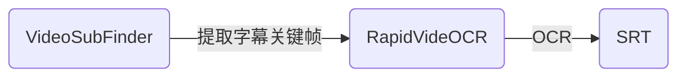

简体中文 | [English](https://github.com/SWHL/RapidVideOCR/blob/main/README.md)

   

 

    
    <a href="">=3.6,<3.12-aff.svg"></a>
    
    
    
    
    
    
    

    
目录

- [简介](#简介)
- [整体框架](#整体框架)
- [使用教程](#使用教程)
- [更新日志（more）](#更新日志more)
- [写在最后](#写在最后)

### 简介
- 视频硬字幕提取，自动生成对应`srt | txt`文件。
- 支持字幕语言：中文 | 英文 （其他可以支持的语言参见：[支持语种列表](https://github.com/PaddlePaddle/PaddleOCR/blob/release/2.1/doc/doc_ch/multi_languages.md#%E8%AF%AD%E7%A7%8D%E7%BC%A9%E5%86%99))
- 可加入QQ群：**706807542**
- 更快更准确地提取视频硬字幕，并提供`srt| txt`两种格式的输出：
  - **更快**：与[VideoSubFinder](https://sourceforge.net/projects/videosubfinder/)软件结合使用，提取关键字幕帧更快。
  - **更准**：采用[RapidOCR](https://github.com/RapidAI/RapidOCR)作为识别库。
  - **更方便**：pip直接安装即可使用。
- 如果遇到问题，首先推荐阅读：[如何向开源社区提问题](https://mp.weixin.qq.com/s/4IZqIqE2Qf7mziQvjSP_aw)，之后再做决定。
- **该工具处于发展中。在使用过程中，如果遇到任何问题，欢迎提issue或者入群反馈。**
- 如果有帮助到您的话，请给个小星星⭐或者赞助一杯咖啡（点击页面最上面的Sponsor中链接）。

### 整体框架

### 使用教程
- [RapidVideOCR初级教程（界面版 下载解压使用）](https://github.com/SWHL/RapidVideOCR/wiki/RapidVideOCR%E5%88%9D%E7%BA%A7%E6%95%99%E7%A8%8B%EF%BC%88%E7%95%8C%E9%9D%A2%E7%89%88-%E4%B8%8B%E8%BD%BD%E8%A7%A3%E5%8E%8B%E4%BD%BF%E7%94%A8%EF%BC%89)
- [RapidVideOCR中级教程（python小白）](https://github.com/SWHL/RapidVideOCR/wiki/RapidVideOCR%E4%B8%AD%E7%BA%A7%E6%95%99%E7%A8%8B%EF%BC%88python%E5%B0%8F%E7%99%BD%EF%BC%89)
- [RapidVideOCR高级教程（有python基础的小伙伴）](https://github.com/SWHL/RapidVideOCR/wiki/RapidVideOCR%E9%AB%98%E7%BA%A7%E6%95%99%E7%A8%8B%EF%BC%88%E6%9C%89python%E5%9F%BA%E7%A1%80%E7%9A%84%E5%B0%8F%E4%BC%99%E4%BC%B4%EF%BC%89)

### 更新日志（[more](https://github.com/SWHL/RapidVideOCR/wiki/%E6%9B%B4%E6%96%B0%E6%97%A5%E5%BF%97)）
- 🛶2023-07-19 v2.2.3 update:
  - 增加对VSF的参数的适配，命令行模式和类初始化时，可以指定VSF命令的同名参数。详细使用参见[link](https://github.com/SWHL/RapidVideOCR/wiki/RapidVideOCR%E9%AB%98%E7%BA%A7%E6%95%99%E7%A8%8B%EF%BC%88%E6%9C%89python%E5%9F%BA%E7%A1%80%E7%9A%84%E5%B0%8F%E4%BC%99%E4%BC%B4%EF%BC%89)
- 🤓2023-07-08 v2.2.2 update:
  - 修复批量识别时，不能读取中文路径的问题
  - 修复漏轴时，SRT中跳过问题。目前当出现某一轴未能识别，则会空出位置，便于校对。
  - 保留VSF识别的中间结果
- 🐲2023-06-22 Desktop v0.0.3 update:
  - 整合VideoSubFinder界面，增加视频批处理
  - 优化多次选取之后，路径保存问题

### 写在最后
- 微信扫描以下二维码，关注**RapidAI公众号**，回复video即可加入RapidVideOCR微信交流群：
    

        
    

- 扫码加入QQ群：
    

        
    

